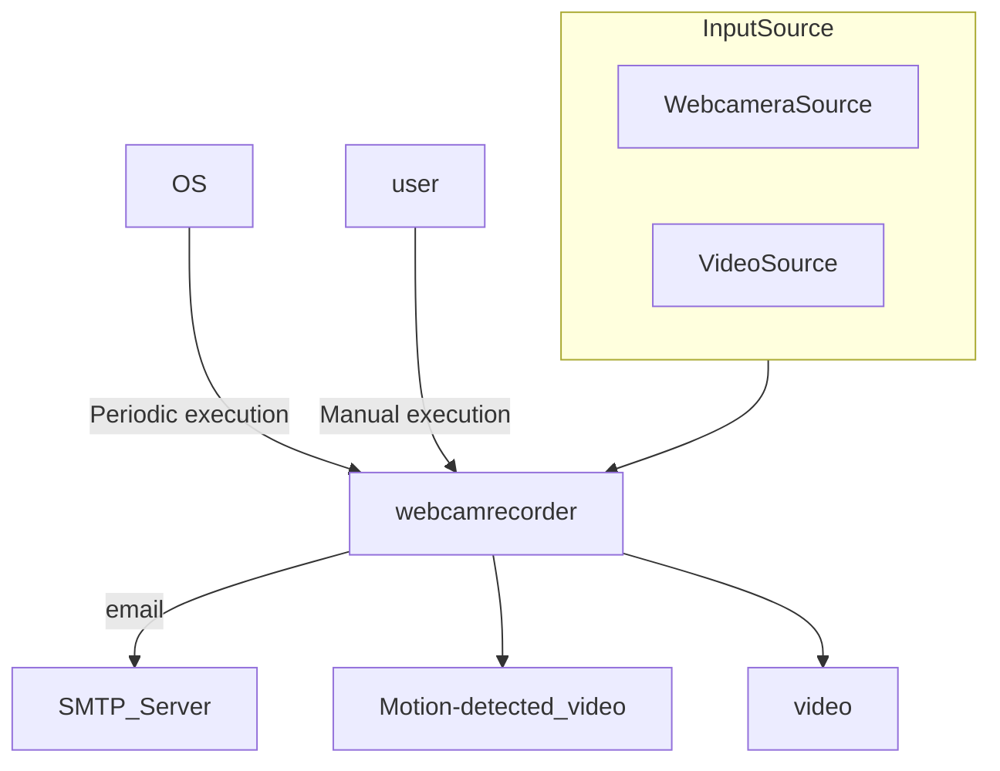
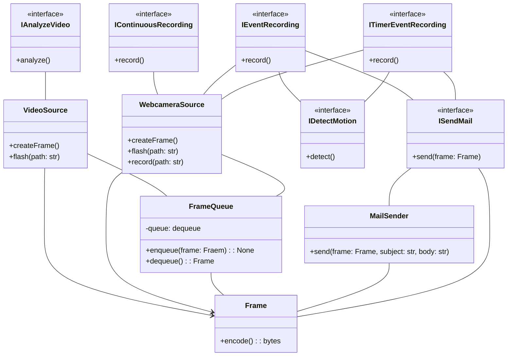

webcamera recorder was created to easily record web camera footage.

# Requirement

* docker
* docker compose

# Installation

clone this git

# Usage

1. rename .env.example to .env
2. edit *WEBCAMERA_URL*
3. execute the following command in this directory
```
docker compose run webcamrecorder record
```

# Detail
this app has several commands are:

## record

start recording.

```
docker compose run webcamrecorder record
```

 Use the following environment variables.

 | name | explanation | default value |
 | ---- | ----------- | ------------- |
 | WEBCAMERA_URL | webcamera url. | rtsp://user:password@ip:port/xxx.sdp |
 | WEBCAMERA_FPS | webcamera fps | 24 |
 | WEBCAMERA_OUTPUTFILENAME | webcamera output filename. The output destination is ./store and the file name is ${WEBCAMERA_OUTPUTFILENAME}_yyyymmddhhmmss.mp4 | webcam1 |
 | WEBCAMERA_RECORD_MINUTES | Recording time. The unit is minutes | 10 |

## event

Start recording when a difference is detected.
The implmentation of motin detection is in *DetectMotion.py*.

```
docker compose run webcamrecorder event
```

 Use the following environment variables.

 | name | explanation | default value |
 | ---- | ----------- | ------------- |
 | WEBCAMERA_URL | webcamera url. | rtsp://user:password@ip:port/xxx.sdp |
 | WEBCAMERA_FPS | webcamera fps | 24 |
 | WEBCAMERA_OUTPUTFILENAME | webcamera output filename. The output destination is ./store and the file name is ${WEBCAMERA_OUTPUTFILENAME}_yyyymmddhhmmss.mp4 | webcam1 |
 | N_FRAME_BEFORE_DETECTED | Specify how many frames to go back from the detection. | 100 |
 | N_FRAME_AFTER_DETECTED | Specify how many frames to record after the detection. | 300 |
 
 
 Set the following environmentvariables if you want to send an email when a detection occurs.


 | name | explanation | default value |
 | ---- | ----------- | ------------- |
 | SMTP_SERVER_ADDRESS | smtp server address | smtp.gmail.com |
 | SMTP_PORT | smtp port | 465 |
 | SMTP_ACCOUNT | smtp account | user@gmail.com | 
 | SMTP_PASSWORD | smtp password | password |
 | MAIL_INTERVAL_MINUTES | Specify the interval in minutes between sending emails. | 1 |
 | MAIL_SUBJECT | mail subject | subject |
 | MAIL_BODY | mail body | body |

## timer

Record only during a specific time period.

```
docker compose run webcamrecorder timer
```

The environment variables are the same as for ***record***, with the following additional environment variables added:

 | name | explanation | default value |
 | ---- | ----------- | ------------- |
 | WEBCAMERA_RECORD_MINUTES | Specify how many minutes to record. | 10 |

## timerevent

start recording when a difference is detected. Stop recording after a specific amount of time has elapsed.

```
docker compose run webcamrecorder timerevent
```

The environment variables are the same as for ***event***, with the following additional environment variables added:

 | name | explanation | default value |
 | ---- | ----------- | ------------- |
 | WEBCAMERA_RECORD_MINUTES | Specify how many minutes to record. | 10 |


## video

Perform differential detection on a specified video file. Use *--path* option to specify the file. It's recommended to place the file in the *store* directory.

```
docker compose run webcamrecorder video --path store/***.mp4
```

 Use the following environment variables.

 | name | explanation | default value |
 | ---- | ----------- | ------------- |
 | N_FRAME_BEFORE_DETECTED | Specify how many frames to go back from the detection. | 100 |
 | N_FRAME_AFTER_DETECTED | Specify how many frames to record after the detection. | 300 |
 
 # Blueprint





# License
[Mit license](https://opensource.org/licenses/mit-license.php)